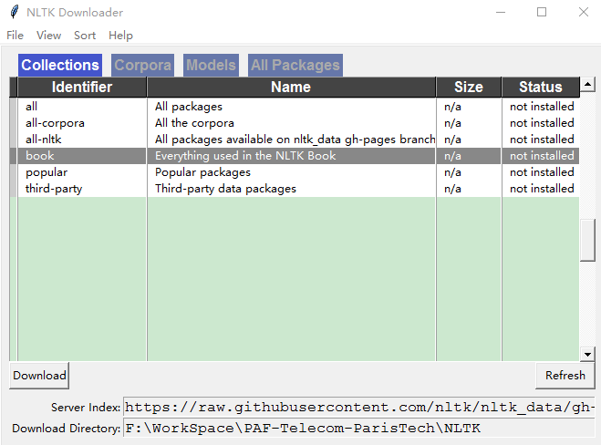
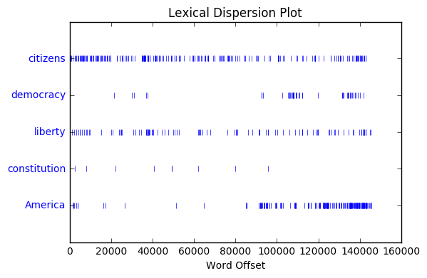

# Chapiter_1 Language Processing and Python

## Getting Started with NLTK


```python
import nltk
nltk.download() # Downloading the NLTK Book Collection
```

Here what we see




```python
from nltk.book import * # load some texts for us to explore from book module
```

    *** Introductory Examples for the NLTK Book ***
    Loading text1, ..., text9 and sent1, ..., sent9
    Type the name of the text or sentence to view it.
    Type: 'texts()' or 'sents()' to list the materials.
    text1: Moby Dick by Herman Melville 1851
    text2: Sense and Sensibility by Jane Austen 1811
    text3: The Book of Genesis
    text4: Inaugural Address Corpus
    text5: Chat Corpus
    text6: Monty Python and the Holy Grail
    text7: Wall Street Journal
    text8: Personals Corpus
    text9: The Man Who Was Thursday by G . K . Chesterton 1908


```python
text1
```


    <Text: Moby Dick by Herman Melville 1851>


## Searching Text

- **concordance** shows us every occurrence of a given word, together with some context.


```python
text1.concordance('monstrous')
```

    Displaying 11 of 11 matches:
    ong the former , one was of a most monstrous size . ... This came towards us ,
    ON OF THE PSALMS . " Touching that monstrous bulk of the whale or ork we have r
    ll over with a heathenish array of monstrous clubs and spears . Some were thick
    d as you gazed , and wondered what monstrous cannibal and savage could ever hav
    that has survived the flood ; most monstrous and most mountainous ! That Himmal
    they might scout at Moby Dick as a monstrous fable , or still worse and more de
    th of Radney .'" CHAPTER 55 Of the Monstrous Pictures of Whales . I shall ere l
    ing Scenes . In connexion with the monstrous pictures of whales , I am strongly
    ere to enter upon those still more monstrous stories of them which are to be fo
    ght have been rummaged out of this monstrous cabinet there is no telling . But
    of Whale - Bones ; for Whales of a monstrous size are oftentimes cast up dead u


- **similar** shows what other words appear in a similar range of contexts


```python
text2.similar('monstrous')
```

    very heartily so exceedingly a as great amazingly good vast sweet
    extremely remarkably


- **common_contexts** allows us to examine the contexts shared by two or more words


```python
text2.common_contexts(['monstrous', 'very'])
```

    be_glad a_pretty am_glad is_pretty a_lucky


- **dispersion_plot** determines the spatial location of a word in the text

for frequency of word usage through time, look at [here](https://books.google.com/ngrams)


```python
text4.dispersion_plot(["citizens", "democracy", "liberty", "constitution", "America"])
```





## Counting Vocabulary

Use the term **len** to get the length of text.


```python
len(text3)
```


    44764


So it has 44,764 words and punctuation symbols, or "tokens".

**Token** is the technical name for a sequence of characters that we want to treat as a group.

**Word type** is the word considered as a unique item of vocabulary. If what we find includes punctuation symbols, then we will generally call these unique items *types* instead of *word types*.


```python
len(set(text3)) # Use sorted(set(text3)) to see all types
```


    2789


```python
len(set(text3)) / len(text3) # measure of the lexical richness of the text
```


    0.06230453042623537


```python
text3.count("smote") # how often a word occurs in a text
```


    5
