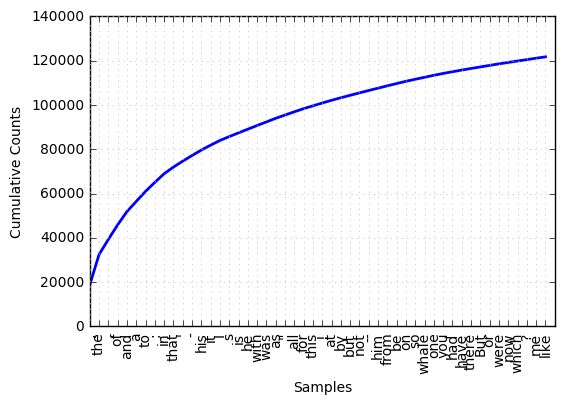
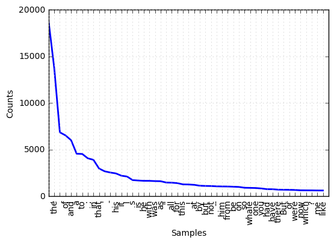

# Chapiter_1 Language Processing and Python

## Getting Started with NLTK


```python
import nltk
nltk.download() # Downloading the NLTK Book Collection
```

Here what we see


```python
from nltk.book import * # load some texts for us to explore from book module
```


```python
text1
```


    <Text: Moby Dick by Herman Melville 1851>


### Searching Text

- **concordance** shows us every occurrence of a given word, together with some context.


```python
text1.concordance('monstrous')
```

    Displaying 11 of 11 matches:
    ong the former , one was of a most monstrous size . ... This came towards us ,
    ON OF THE PSALMS . " Touching that monstrous bulk of the whale or ork we have r
    ll over with a heathenish array of monstrous clubs and spears . Some were thick
    d as you gazed , and wondered what monstrous cannibal and savage could ever hav
    that has survived the flood ; most monstrous and most mountainous ! That Himmal
    they might scout at Moby Dick as a monstrous fable , or still worse and more de
    th of Radney .'" CHAPTER 55 Of the Monstrous Pictures of Whales . I shall ere l
    ing Scenes . In connexion with the monstrous pictures of whales , I am strongly
    ere to enter upon those still more monstrous stories of them which are to be fo
    ght have been rummaged out of this monstrous cabinet there is no telling . But
    of Whale - Bones ; for Whales of a monstrous size are oftentimes cast up dead u


- **similar** shows what other words appear in a similar range of contexts


```python
text2.similar('monstrous')
```

    very exceedingly so heartily extremely great as good sweet remarkably
    amazingly a vast


- **common_contexts** allows us to examine the contexts shared by two or more words


```python
text2.common_contexts(['monstrous', 'very'])
```

    is_pretty a_pretty am_glad be_glad a_lucky


- **dispersion_plot** determines the spatial location of a word in the text

for frequency of word usage through time, look at [here](https://books.google.com/ngrams)


```python
text4.dispersion_plot(["citizens", "democracy", "liberty", "constitution", "America"])
```


### Counting Vocabulary

Use the term **len** to get the length of text.


```python
len(text3)
```


    44764


So it has 44,764 words and punctuation symbols, or "tokens".

**Token** is the technical name for a sequence of characters that we want to treat as a group.

**Word type** is the word considered as a unique item of vocabulary. If what we find includes punctuation symbols, then we will generally call these unique items *types* instead of *word types*.


```python
len(set(text3)) # Use sorted(set(text3)) to see all types
```


    2789


```python
len(set(text3)) / len(text3) # measure of the lexical richness of the text
```


    0.06230453042623537


```python
text3.count("smote") # how often a word occurs in a text
```


    5


## Frequency Distributions

**Frequency Distributions** tells us the frequency of each vocabulary item in the text.

**Hapaxes** are the words that occur once only.


```python
fdist1 = FreqDist(text1)

print(fdist1)
print (fdist1.most_common(5)) # find the 5 most frequent words
print (fdist1.hapaxes()[:5]) # show the first 5 hapaxes
print ('"or" counts ' + str(fdist1['or']) + ' times.') # show how many times the word 'or' appears

fdist1.plot(50, cumulative=True) # a cumulative frequency plot for the 50 most frequent words
fdist1.plot(50, cumulative=False) # a non-cumulative frequency plot for the 50 most frequent words
```

    <FreqDist with 19317 samples and 260819 outcomes>
    [(',', 18713), ('the', 13721), ('.', 6862), ('of', 6536), ('and', 6024)]
    ['fringed', 'Parallel', 'Somehow', 'Formosa', 'managed']
    "or" counts 697 times.








### Fine-grained Selection of Words

These very long words are often hapaxes and perhaps it would be better to find **frequently** occurring **long** words.


```python
fdist5 = FreqDist(text5)
sorted(w for w in set(text5) if len(w) > 7 and fdist5[w] > 7)
# all words that are longer than seven characters, that occur more than seven times
```


    ['#14-19teens',
     '#talkcity_adults',
     '((((((((((',
     '........',
     'Question',
     'actually',
     'anything',
     'computer',
     'cute.-ass',
     'everyone',
     'football',
     'innocent',
     'listening',
     'remember',
     'seriously',
     'something',
     'together',
     'tomorrow',
     'watching']


### Collocations and Bigrams

**Collocation** : a *sequence* of words that occur together **unusually often**.

Thus `red wine` is a collocation, whereas `the wine` is not. A characteristic of collocations is that they are *resistant to substitution* with words that have similar senses; for example, `maroon wine` sounds definitely odd.

**bigram** : start off by extracting from a text a list of **word pairs**, also known as bigrams.


```python
from nltk import bigrams
print (list(bigrams(['more', 'is', 'said', 'than', 'done'])))
text8.collocations() # find bigrams based on the frequency of the individual words
```

    [('more', 'is'), ('is', 'said'), ('said', 'than'), ('than', 'done')]
    would like; medium build; social drinker; quiet nights; non smoker;
    long term; age open; Would like; easy going; financially secure; fun
    times; similar interests; Age open; weekends away; poss rship; well
    presented; never married; single mum; permanent relationship; slim
    build


Here is a resume of functions defined for NLTK's Frequency Distributions

|Example|Description|
|---|---|
|fdist = FreqDist(samples)|create a frequency distribution containing the given samples|
|fdist[sample] += 1|increment the count for this sample|
|fdist['monstrous']|count of the number of times a given sample occurred|
|fdist.freq('monstrous')|frequency of a given sample|
|fdist.N()|total number of samples|
|fdist.most_common(n)|the n most common samples and their frequencies|
|for sample in fdist:|iterate over the samples|
|fdist.max()|sample with the greatest count|
|fdist.tabulate()|tabulate the frequency distribution|
|fdist.plot()|graphical plot of the frequency distribution|
|fdist.plot(cumulative=True)|cumulative plot of the frequency distribution|
|fdist1 < fdist2|test if samples in fdist1 occur less frequently than in fdist2|

And here is a resume of useful word comparison operators in python

|Function|Meaning|
|---|---|
|s.startswith(t)|test if s starts with t|
|s.endswith(t)|test if s ends with t|
|t in s|test if t is a substring of s|
|s.islower()|test if s contains cased characters and all are lowercase|
|s.isupper()|test if s contains cased characters and all are uppercase|
|s.isalpha()|test if s is non-empty and all characters in s are alphabetic|
|s.isalnum()|test if s is non-empty and all characters in s are alphanumeric|
|s.isdigit()|test if s is non-empty and all characters in s are digits|
|s.istitle()|test if s contains cased characters and is titlecased (i.e. all words in s have initial capitals)|

## Challenges in Automatic Natural Language Understanding

For more details, refer to [chapiter one](http://www.nltk.org/book/ch01.html) of this book.

- **Word Sense Disambiguation**, work out which sense of a word was intended in a given context
- **Pronoun Resolution**, work out "who did what to whom"
- **Generating Language resource/output**, `Spoken Dialog Systems` or `Machine Translation`
- **Textual Entailment**, Recognizing Textual Entailment(RTE), for exemple find evidence to support the hypothesis
