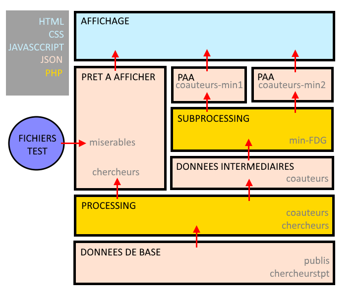

# Visualisation

Ce dossier regroupe tous les scripts permettant un affichage des données. Un lexique des abbréviations se trouve en bas de page.

## Lexique

- PAA: Prêt à afficher. Les plugins JavaScript utilisés pour afficher les données ne prennent en entrée qu'un certain formatage de fichier JSON ou CSV. Si un jeu de données a un formatage qui corresponds à un certain affichage, on dit ici 
- FDG: [force-directed graph](https://bl.ocks.org/mbostock/4062045)
- ZFDG: [zoomable force-directed graph](https://bl.ocks.org/pkerpedjiev/f2e6ebb2532dae603de13f0606563f5b)
- CT: [collapsible tree](https://bl.ocks.org/mbostock/4339083)
- SG: [Streamgraph](http://bl.ocks.org/WillTurman/4631136)

## Explication de la méthode et des liens entre les scripts

La méthode utilisée pour visualiser les fichiers est la suivante:
1. Des données JSON sont produites en amont par SPARQL à partir de la base de données RDF
2. Des scripts PHP construisent à partir de ces données des PAA
3. D'autres scripts PHP filtrent certaines de ces données afin de les rendre plus pertinentes, plus lisibles ou plus rapides à afficher
4. Un dernier script PHP *display.php* va produire la page HTML sur laquelle vont apparaître les graphs. Par exemple, l'affichage du graph ZFDG des co-auteurs va se trouver à l'adresse *display.php?dataURL=data/coauteurs.json&graphType=ZFDG*.

J'ai choisi cette architecture car elle permet une indépendance totale entre les fichiers JSON de base que me donnera Fonda Zhu et le lien qu'intègrera Cherif Diallo sur son site.

La méthode et les emplacements des fichiers peut donc être visualisée de la manière suivante:

Les fichiers du répertoire **visualisation** sont en cours de mise à jour.

Par `Nino Filiu`
